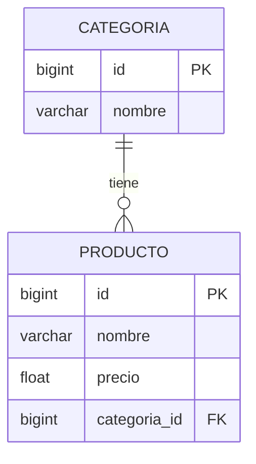

# Actividad 3 - CRUD API con Spring Boot

**Alumno:** Gonzalez Valentin Adrian
**Materia:** Programación Web
---

Proyecto de API REST desarrollado en Spring Boot para la gestión de productos y categorías.

## Descripción
Este proyecto implementa un CRUD (Create, Read, Update, Delete) completo utilizando **Spring Boot**, **Spring Data JPA** y **MySQL**. Se ha modelado una relación de uno a muchos (One-to-Many) entre las entidades `Categoria` y `Producto`.

## Entidades y Relaciones
El sistema se compone de dos entidades principales relacionadas:
*   **Categoria**: Contiene el nombre y su identificador único.
*   **Producto**: Contiene nombre, precio y una relación `@ManyToOne` con Categoria.

## Evidencia de Funcionamiento

### 1. Base de Datos
Aquí se muestra la estructura de las tablas creadas automáticamente por Hibernate en MySQL:

### 2. Operaciones CRUD (Postman/Bruno)
A continuación, se presentan las pruebas de los endpoints:

*   **Crear Producto (POST):**
    

    
    
*   **Leer Productos (GET):**
    

*   **Actualizar Producto (PUT):**
    

*   **Eliminar Producto (DELETE):**
    

##  Utilizado en esta Actividad:
*   Java 25+
*   Spring Boot
*   Spring Data JPA
*   MySQL
*   Maven

